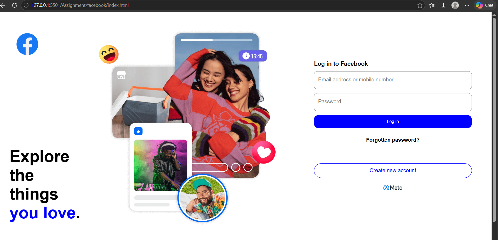
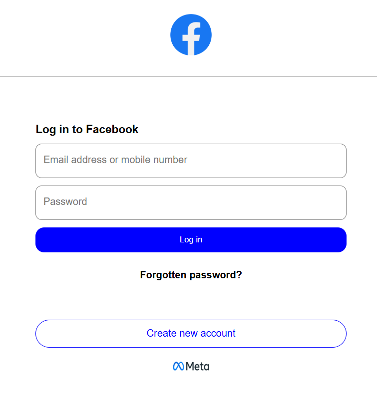

# Facebook Login Page Clone

A responsive UI clone of the Facebook login page, built with HTML and CSS as a front-end practice project.

> **Disclaimer:** This is an educational UI clone for practice only. It is not affiliated with, endorsed by, or connected to Meta or Facebook. The form does not collect, store, or transmit any data.

**Live demo:** https://shamitha-2330.github.io/facebook-login-clone/

## Screenshots

| Desktop | Mobile |
|---|---|
|  |  |

## Features

- Two-column desktop layout: promotional illustration on the left, login form on the right
- Responsive design: collapses to a single centered column on smaller screens
- Styled login form with email/mobile and password fields
- "Log in", "Forgotten password?" and "Create new account" actions
- Clean, semantic HTML and organised CSS

## Tech Stack

- HTML5
- CSS3 (Flexbox, media queries)

## What I Practiced

- Building a pixel-aware layout from a real-world design
- Flexbox for aligning and spacing components
- Media queries for responsive behaviour across screen sizes
- Styling form inputs and buttons

## Project Structure

```
facebook-login-clone/
├── index.html
├── style.css
├── Images/
│   ├── desktop_view.png
│   └── mobile_view.png
└── README.md
```

Adjust the tree to match your actual folder layout.

## Run Locally

```bash
git clone https://github.com/Shamitha-2330/facebook-login-clone.git
cd facebook-login-clone
```

Open `index.html` in your browser, or use the Live Server extension in VS Code.

## Author

**Shamitha**

## License

For educational purposes only. All brand names, logos, and trademarks belong to their respective owners.
